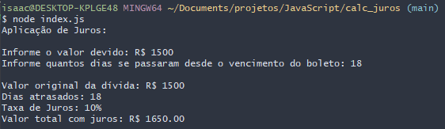

## Calculadora de Juros

Este projeto realiza o cálculo de juros de uma dívida baseado no valor da dívida inicial e nos dias de atraso.

Aplicação realizada utilizando node.js e com importação do "readline-sync" para entrada de dados no terminal.

### Regras de negócio

- Se o valor da dívida não for maior que zero (0), a aplicação é encerrada informando que precisa ser maior que zero.
- Se os dias de atraso for igual a zero, a aplicaão é encerrada informando que a pessoa está em dia com a dívida.
- Se os dias de atraso for menor ou igual a 15 dias, o juros calculado será de 5%.
- Se os dias de atraso for maior que 15 dias, o juros calculado será de 10%.

